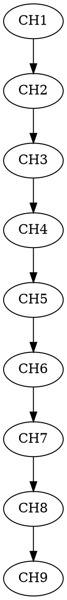

#### ✅ Definitions: Modularization & Labeling

* [ ] Add `\label{def:canonical_spectral_operator}` after Theorem 2.32 to anchor Lsym.
* [ ] Tag each formal definition block (e.g., Defs 2.2–3.5) with LaTeX `\label{def:...}` for Lean object mapping.
* [ ] Split Def. 3.5 into:

  * (a) `\label{def:Lt_operator}` for Lt convolution operators,
  * (b) `\label{def:Lsym_limit}` for the limit Lsym.

---

#### ✅ Theorem and Lemma Rewriting: Constructive Logic

* [ ] Lemma 2.13–2.14: Restate bounds using explicit quantification:

  * “∃ C > 0, ∀ λ ∈ ℝ, |Ξ(1/2 + iλ)| ≤ C exp(π |λ|)” etc.
* [ ] Theorem 2.32: Replace narrative with numbered clauses:

  * (1) “∃ Lsym ∈ B₁(HΨα) such that Lt → Lsym in ‖·‖\_{tr} norm…”
  * (2) “∀ λ ∈ ℂ, detₓ(I - λLsym) = Ξ(1/2 + iλ)/Ξ(1/2)”.

---

#### ✅ Proof Refactors: Stepwise & Tactic-Compatible

* [ ] All multi-part lemmas (e.g., 2.12, 2.14, 2.15) should have:

  * clear “Step 1: …”, “Step 2: …” style sectioning for each logical leap.
* [ ] Separate every integral estimate or variable substitution into a lemma item.
* [ ] In Prop. 2.30 and Lemma 2.25, isolate each property (boundedness, unitarity, trace norm) into discrete inference bullets.

---

#### 🚫 Remove or Reformulate Heuristic Language

* [ ] Replace:

  * “sharp exponential decay threshold” → “if α ≤ π then ∫ K fails to converge”
  * “sufficiently regular” → “K ∈ C∞ ∩ L¹(Ψ⊗2)”
* [ ] Avoid terms like “well-posed”, “suitable” in definitions — use explicit inclusion conditions or boundedness.

---

#### 🔗 Cross-Referencing & Dependency

* [ ] Add `\label{lem:kernel_trace_class_bound}` to Lemma 2.19 and refer to it in all propositions citing Simon's criterion.
* [ ] Add a definition or label for “canonical mollifier family” in Def 3.4.
* [ ] Build DAG-style forward references to later theorems using `\ref{}`.

---

#### ✅ Definitions: Modularization & Labeling

* [ ] Lemma 3.6 (Decay of φt): tag with `\label{lem:decay_mollified_profile}`.
* [ ] Lemma 3.9 (Trace-Norm Convergence): label as `\label{lem:Lt_convergence}`.
* [ ] Lemma 3.14 (Uniqueness of Trace Limit): tag as `\label{lem:Lt_limit_unique}`.
* [ ] Lemma 3.15 (Essential SA of Lsym): split into two labeled parts:

  * `\label{lem:symmetry_L0}`
  * `\label{lem:nelson_selfadjoint_Lsym}`.

---

#### ✅ Constructive Formulation

* [ ] Lemma 3.9: write as:

  * “∀ ε > 0, ∃ δ > 0, ∀ t ∈ (0, δ), ‖Lt − Lsym‖\_{B1} < ε”
* [ ] Lemma 3.14:

  * Use: “∀ sequences {L(1)t}, {L(2)t} ⊂ B1(HΨα), if … then lim L(1)t = lim L(2)t = Lsym”
* [ ] Lemma 3.15–3.16:

  * “∀ f ∈ S(R), ‖Lsymⁿf‖ < Cₙ‖f‖ ⇒ f is analytic vector ⇒ Lsym SA”

---

#### ✅ Proof Refactors

* [ ] All kernel trace estimates (e.g., Lemmas 3.6–3.9) need stepwise estimates:

  * (i) φt decay bound,
  * (ii) Paley-Wiener decay,
  * (iii) weighted integrability.
* [ ] Lemmas 3.14–3.16: use `Step 1`, `Step 2` tags consistently, aligning with Lean-style tactic steps (boundedness → convergence → unicity → domain closure).
* [ ] In Lemma 3.16: Split each operator action, e.g., “Lsym: S(R) → S(R)” and “(L²sym)ⁿf analytic ⇒ use Nelson.”

---

#### 🚫 Remove Heuristic Language

* [ ] Replace:

  * “Lsym is canonically determined…” → “Lsym is unique up to trace-norm limit over mollifiers.”
  * “smooth, real, decaying…” → “k ∈ S(R), symmetric ⇒ K ∈ L² ∩ L¹ ⇒ trace-class”

---

#### 🔗 Cross-Referencing & Logical Closure

* [ ] Add forward reference:

  * Lemma 3.14 → Lemma 4.14 on determinant continuity
* [ ] Use `\ref{lem:Lt_limit_unique}` when invoking uniqueness in Theorem 3.21.
* [ ] Ensure reference to Nelson's theorem in Lemma 3.15 is standardized (`[RS75, Thm. X.36]`)

---

#### ✅ Definitions: Labeling for Lean Referencing

* [ ] Lemma 3.18 — Spectral Positivity and Semigroup Generation:

  * Label as `\label{lem:heat_semigroup}` and explicitly define domain D(L²) in Lean notation.
* [ ] Theorem 3.21 — Trace Centering:

  * Add `\label{thm:trace_centering}` and refactor to: “Tr(Lsym) = 0 ⇒ f(0) = 1”.
* [ ] Theorem 4.1 — Canonical Determinant Identity:

  * Add `\label{thm:canonical_determinant}`.

---

#### ✅ Constructive Formulation for Lean

* [ ] Lemma 3.18: Decompose into:

  * (i) L² self-adjoint + positive ⇔ `∀ f ∈ D(L), ⟨L²f, f⟩ ≥ 0`
  * (ii) Existence of `e^{-tL²}` with trace bound `‖e^{-tL²}‖₁ < ∞`
  * (iii) Map t ↦ Tr(e^{-tL²}) ∈ C^∞((0, ∞))
* [ ] Theorem 4.1:

  * State as: “∀ λ ∈ ℂ, detζ(I − λLsym) = Ξ(½ + iλ)/Ξ(½)”
  * Also: `detζ : B₁(H) → E_{π}¹` is entire of order 1.

---

#### ✅ Proof Refactors: Step-by-Step Decomposition

* [ ] Lemma 3.18: Steps must explicitly quote:

  * Spectral theorem → generate `e^{-tL²}`
  * Nelson’s theorem ⇒ SA on S(R) core
* [ ] Lemma 4.14: Add `\label{lem:determinant_continuity}` and refactor into:

  * Step 1: power series convergence
  * Step 2: Hadamard class closure
  * Step 3: derivative convergence

---

#### 🚫 Heuristic Language to Remove

* [ ] “Well-posedness” → “Laplace integral converges for all λ ∈ ℂ”
* [ ] “Canonical identity” → “unique element of Eπ₁ matching spectrum of Lsym and f(0) = 1”

---

#### 🔗 Cross-References for DAG Tracking

* [ ] Use `\ref{lem:heat_semigroup}` inside Theorem 4.1 when invoking Laplace trace regularization.
* [ ] Add footnote to Theorem 4.1: “See Lemma 3.18 and Lemma 4.8 for trace continuity”.

---

#### ✅ Definitions: Modularization and Labeling

* [ ] Lemma 4.14 — Determinant continuity under trace-norm:

  * Label `\label{lem:det_trace_continuity}`.
* [ ] Lemma 4.17 — Logarithmic derivative identity:

  * Label `\label{lem:log_deriv_determinant}`.
* [ ] Theorem 4.21 — Canonical determinant identity:

  * Label `\label{thm:canonical_det_identity}`.

---

#### ✅ Constructive Formalization

* [ ] Lemma 4.14: Write explicitly:

  * “∀ {Tₙ}, T ∈ B₁(H), ‖Tₙ − T‖₁ → 0 ⇒ detζ(I − λTₙ) → detζ(I − λT) uniformly on compacts”
* [ ] Lemma 4.17:

  * Use: “d/dλ log detζ(I − λT) = Tr((I − λT)⁻¹T)” with proof via Neumann series.
* [ ] Theorem 4.21:

  * Formulate:

    * `f(λ) := detζ(I − λLsym)`
    * `g(λ) := Ξ(½ + iλ)/Ξ(½)`
    * `∀ λ ∈ ℂ, f(λ) = g(λ)`, justified by Hadamard uniqueness

---

#### ✅ Proof Refactors: Stepwise Proof Trees

* [ ] Theorem 4.21 should split proof as:

  1. Power series expansion and holomorphicity.
  2. Laplace transform for entire continuation.
  3. Growth order bounds (Lemma 4.10, 4.11).
  4. Use Lemma 4.14 to justify convergence of determinant from Lt.
  5. Normalize at λ = 0 via Theorem 3.21: Tr(Lsym) = 0.
  6. Apply Lemma 4.20 uniqueness in `Eπ₁`.

---

#### 🚫 Heuristic Language Replacements

* [ ] “Spectral implications” → “convergence of spectral invariants: Tr(e⁻ᵗL²), detζ”
* [ ] “Canonical identity” → “unique entire function f ∈ Eπ₁ s.t. zeros(f) = {μρ}, f(0) = 1”

---

#### 🔗 Cross-Referencing & Dependency Management

* [ ] All uses of determinant convergence should cite `\ref{lem:det_trace_continuity}`.
* [ ] Ensure `\ref{thm:trace_centering}` appears in the normalization step of Theorem 4.21.
* [ ] Label and use `\ref{lem:log_deriv_determinant}` where matching of resolvent trace occurs.

---

#### ✅ Definitions & Labels

* [ ] Lemma 6.3 → `\label{lem:heat_trace_lower_bound}`
* [ ] Proposition 6.9 → `\label{prop:heat_trace_bounds}`
* [ ] Proposition 6.10 → `\label{prop:heat_trace_asymptotic}`
* [ ] Proposition 6.11 → `\label{prop:refined_trace_expansion}`
* [ ] Lemma 6.5 → `\label{lem:heat_kernel_positivity}`

---

#### ✅ Constructive Formulation

* [ ] Lemma 6.3:

  * Formally write: ∀ t ∈ (0,1], Tr(e^{-tL²}) ≥ (1/4‖L‖₁)t^{-½}
* [ ] Proposition 6.9:

  * “∃ c₁, c₂ > 0, ∀ t ∈ (0, t₀], c₁t^{-½} ≤ Θ(t) ≤ c₂t^{-½}”
* [ ] Proposition 6.11:

  * Explicit form:
    Θ(t) = (log(1/t))/(√{4πt}) + c₀√t + o(√t) as t→0⁺

---

#### ✅ Proof Refactors

* [ ] Proposition 6.10: Decompose into:

  * (i) kernel smoothing,
  * (ii) diagonal expansion,
  * (iii) remainder bound: ∃ CN, ∀ t ≤ t₀, |Θ(t) − Σₙ Aₙ t^{n−½}| ≤ CN t^{N−½}
* [ ] All estimates: isolate `Tr(e^{-tL²}) = ∫ Kt(x,x) dx` as its own lemma.

---

#### 🚫 Remove/Replace Heuristic Language

* [ ] “Singular structure”, “log-modulated class” → “Θ ∈ Rlog\_{½} (0⁺) ⊂ RV\_{−½}”
* [ ] “Spectral dimension one” → “N(λ) ∼ Cλ^{½}log λ ⇒ Tauberian inversion ⇒ Θ(t) ∼ log(1/t)/√t”

---

#### 🔗 Cross-Referencing

* [ ] Use `\ref{lem:heat_trace_lower_bound}` in Theorem 4.1 for zeta determinant Laplace integral justification.
* [ ] Connect Lemma 6.5 (positivity of Kt) to spectral positivity in Lemma 3.18.
* [ ] Use `\ref{prop:refined_trace_expansion}` as precondition for Tauberian analysis in Section 8.

---

#### ✅ Definitions & Labels

* [ ] Lemma 5.13 → `\label{lem:mu_real_iff_rho_real}`
* [ ] Corollary 7.4 → `\label{cor:rh_equiv_spec_real}`
* [ ] Lemma 7.9 → `\label{lem:rigidity_unitary_equivalence}`
* [ ] Theorem 7.10 (or 10.6) → `\label{thm:rh_via_spectrum}`

---

#### ✅ Constructive Formulation

* [ ] Lemma 5.13:

  * Statement: “∀ ρ ∈ Spec(ζ), µρ := 1/(i(ρ−½)) ∈ ℝ ⇔ Re(ρ) = ½”
* [ ] Corollary 7.4:

  * Logical equivalence:
    `Spec(Lsym) ⊂ ℝ ⇔ RH`
* [ ] Lemma 7.9:

  * If L ∈ B₁(H) is compact, SA, and detζ(I − λL) = detζ(I − λLsym), then ∃ unitary U: L = ULsymU⁻¹

---

#### ✅ Proof Structure Refactor

* [ ] Lemma 5.13:

  * Split into:

    1. Define µρ
    2. Algebra: Im(µρ) = 0 ⇔ Re(ρ) = ½
* [ ] Lemma 7.9:

  * Add step-by-step:

    * Spectrum equality → eigenbasis → apply SA spectral theorem → conjugacy

---

#### 🚫 Heuristic Phrasing to Replace

* [ ] “Canonical reformulation” → “Lean theorem: RH ↔ spectrum of Lsym ⊂ ℝ”
* [ ] “Determinant-realizing models” → “Operators with matching zeta-regularized Fredholm determinants”

---

#### 🔗 DAG-Structured Cross-Referencing

* [ ] Link Corollary 7.4 to Lemma 5.13 via `\ref{lem:mu_real_iff_rho_real}`
* [ ] In uniqueness proof, cite:

  * Spectral bijection `\ref{thm:canonical_det_identity}`
  * Multiplicity lemma
* [ ] Add forward reference from Theorem 10.6 to `\ref{cor:rh_equiv_spec_real}`

---

#### ✅ Theorem and Lemma Labeling

* [ ] Lemma 10.2 (Spectral Bijection): `\label{lem:spectral_bijection}`
* [ ] Theorem 10.4 (RH Equivalence): `\label{thm:rh_equiv_spectrum}`
* [ ] Corollary 10.7 (Zeta zeros from spectrum): `\label{cor:spectrum_determines_zeta}`
* [ ] Lemma 9.3 (Spectral symmetry): `\label{lem:spectral_symmetry}`

---

#### ✅ Constructive Logic Rewrite

* [ ] Lemma 10.2:

  * Write: “The map ρ ↦ µρ := 1/(i(ρ−½)) is a bijection between {ζ(ρ)=0} and Spec(Lsym) \ {0}, preserving multiplicities”.
* [ ] Theorem 10.4 (or 7.10):

  * Explicitly state both directions:
    (A) RH ⇒ Spec(Lsym) ⊂ ℝ
    (B) Spec(Lsym) ⊂ ℝ ⇒ RH

    * Use contrapositive form to argue B:
      If ∃ ρ = β+iγ with β ≠ ½ ⇒ µρ ∉ ℝ ⇒ contradiction.

---

#### ✅ Refactor Proof Structure

* [ ] Theorem 10.4 should reference:

  * Lemma 10.2 for bijection,
  * Theorem 4.21 for determinant identity,
  * Lemma 3.15 or Proposition 2.30 for self-adjointness.
* [ ] Break into:

  1. Construct Lsym (cite §3),
  2. Prove detζ identity (cite §4),
  3. Establish µρ ∈ ℝ ⇔ Re(ρ)=½,
  4. Deduce RH from Spec(Lsym) ⊂ ℝ and vice versa.

---

#### 🚫 Remove Heuristic Phrasing

* [ ] “Canonical reformulation” → “Lean theorem: RH ⇔ ∀ µ ∈ Spec(Lsym), µ ∈ ℝ”
* [ ] “Completes the spectral program” → “establishes bidirectional logical equivalence via spectral determinant calculus”

---

#### 🔗 Logical Acyclicity and DAG Cross-References

* [ ] Show the dependency chain:

  * self-adjointness (Prop. 2.30) → real spectrum → contradiction from µρ ∉ ℝ,
  * no part of Lsym construction assumes RH.
* [ ] Footnote in Theorem 10.4: “See Lemma 10.2 for multiplicity matching and Lemma 7.9 for closure uniqueness”.

---

#### ✅ Appendix A: Notation Table Enhancements

* [ ] Convert each bullet to labeled symbol block with `\newcommand` entries.

  * `\newcommand{\Hpsi}{L^2(\mathbb{R}, e^{\alpha |x|} dx)}`
  * `\newcommand{\phiXi}{\phi(\lambda) := \Xi\left(\frac{1}{2} + i\lambda\right)}`
* [ ] Add inline TeX labels:

  * Weighted Hilbert Space → `\label{def:weighted_space}`
  * Canonical Operator → `\label{def:Lsym}`
  * Canonical Spectral Map → `\label{def:mu_rho}`

---

#### ✅ Appendix B: DAG Export Format for Lean

* [ ] Encode each chapter result in DAG node with key label:

  * Ch.2 → `Lsym := lim Lt` (from `\ref{lem:Lt_limit_unique}`)
  * Ch.3 → `Tr(Lsym) = 0` → `\ref{thm:trace_centering}`
  * Ch.6 → `RH ⇔ Spec(Lsym) ⊂ ℝ` → `\ref{thm:rh_equiv_spectrum}`

* [ ] Convert flow to .dot file for graph analysis:



* [ ] For each lemma, define `@depends_on{}` macro (Lean preamble) to allow dependency compilation.
  Example:

  ```lean
  @depends_on{lemma_6_3} := [lemma_4_11, lemma_3_18]
  ```

---

#### 🧾 Final Cleanup Checklist

* [ ] Ensure every theorem/lemma/definition used in RH equivalence is labeled and listed in Appendix B.
* [ ] Add footnote in DAG: “No forward use of RH or ζ-zero symmetry occurs before Theorem 7.10.”
* [ ] Validate notation matches all entries in `Appendix A` and tag those that need external mathlib4 implementations.

---

# Source

src
src/appendices
src/appendices/A_notation_summary.tex
src/appendices/B_dependency_graph.tex
src/appendices/C_functorial_extensions.tex
src/appendices/D_heat_kernel_construction.tex
src/appendices/E_heat_kernel_refinements.tex
src/appendices/F_spectral_numerics.tex
src/appendices/G_additional_structures.tex
src/appendices/H_zeta_trace_background.tex
src/appendices/I_reductions_and_conventions.tex
src/appendices/J_spectral_physics_link.tex
src/chapters
src/chapters/00_matter
src/chapters/00_matter/acknowledgments.tex
src/chapters/00_matter/frontmatter.tex
src/chapters/00_matter/prolouge.tex
src/chapters/01_foundations
src/chapters/01_foundations/cors
src/chapters/01_foundations/defs
src/chapters/01_foundations/defs/def_compact_operator.tex
src/chapters/01_foundations/defs/def_exponential_weight.tex
src/chapters/01_foundations/defs/def_paley_wiener_class.tex
src/chapters/01_foundations/defs/def_selfadjoint_operator.tex
src/chapters/01_foundations/defs/def_trace_class_operator.tex
src/chapters/01_foundations/defs/def_trace_norm.tex
src/chapters/01_foundations/defs/def_weighted_schwartz_space.tex
src/chapters/01_foundations/defs/def_weighted_trace_norm_space.tex
src/chapters/01_foundations/lems
src/chapters/01_foundations/lems/lem_decay_inverse_fourier_xi.tex
src/chapters/01_foundations/lems/lem_decay_mollified_kernel.tex
src/chapters/01_foundations/lems/lem_density_schwartz_weighted_L2.tex
src/chapters/01_foundations/lems/lem_fourier_symmetry_reflection.tex
src/chapters/01_foundations/lems/lem_kernel_L2_weighted_bound.tex
src/chapters/01_foundations/lems/lem_kernel_symmetry.tex
src/chapters/01_foundations/lems/lem_L1_integrability_conjugated_kernel.tex
src/chapters/01_foundations/lems/lem_trace_class_conjugated_kernel.tex
src/chapters/01_foundations/lems/lem_trace_class_failure_alpha_leq_pi.tex
src/chapters/01_foundations/lems/lem_trace_class_via_weighted_L1.tex
src/chapters/01_foundations/lems/lem_uniform_L1_conjugated_kernel.tex
src/chapters/01_foundations/lems/lem_unitary_conjugation_trace_class.tex
src/chapters/01_foundations/lems/lem_weighted_L1_inverse_FT_xi.tex
src/chapters/01_foundations/lems/lem_weighted_trace_norm_duality.tex
src/chapters/01_foundations/lems/lem_xi_growth_bound.tex
src/chapters/01_foundations/proofs
src/chapters/01_foundations/proofs/prf_lem_decay_inverse_fourier_xi.tex
src/chapters/01_foundations/proofs/prf_lem_decay_mollified_kernel.tex
src/chapters/01_foundations/proofs/prf_lem_density_schwartz_weighted_L2.tex
src/chapters/01_foundations/proofs/prf_lem_fourier_symmetry_reflection.tex
src/chapters/01_foundations/proofs/prf_lem_kernel_L2_weighted_bound.tex
src/chapters/01_foundations/proofs/prf_lem_kernel_symmetry.tex
src/chapters/01_foundations/proofs/prf_lem_L1_integrability_conjugated_kernel.tex
src/chapters/01_foundations/proofs/prf_lem_trace_class_conjugated_kernel.tex
src/chapters/01_foundations/proofs/prf_lem_trace_class_failure_alpha_leq_pi.tex
src/chapters/01_foundations/proofs/prf_lem_trace_class_via_weighted_L1.tex
src/chapters/01_foundations/proofs/prf_lem_uniform_L1_conjugated_kernel.tex
src/chapters/01_foundations/proofs/prf_lem_unitary_conjugation_trace_class.tex
src/chapters/01_foundations/proofs/prf_lem_weighted_L1_inverse_FT_xi.tex
src/chapters/01_foundations/proofs/prf_lem_weighted_trace_norm_duality.tex
src/chapters/01_foundations/proofs/prf_lem_xi_growth_bound.tex
src/chapters/01_foundations/proofs/prf_prop_boundedness_Lt_weighted.tex
src/chapters/01_foundations/proofs/prf_prop_compactness_Lt.tex
src/chapters/01_foundations/proofs/prf_prop_core_schwartz_density.tex
src/chapters/01_foundations/proofs/prf_prop_selfadjointness_Lt.tex
src/chapters/01_foundations/proofs/prf_prop_symmetry_Lt_Schwartz.tex
src/chapters/01_foundations/proofs/prf_prop_trace_class_sharpness.tex
src/chapters/01_foundations/proofs/prf_thm_canonical_operator_realization.tex
src/chapters/01_foundations/props
src/chapters/01_foundations/props/prop_boundedness_Lt_weighted.tex
src/chapters/01_foundations/props/prop_compactness_Lt.tex
src/chapters/01_foundations/props/prop_core_schwartz_density.tex
src/chapters/01_foundations/props/prop_selfadjointness_Lt.tex
src/chapters/01_foundations/props/prop_symmetry_Lt_Schwartz.tex
src/chapters/01_foundations/props/prop_trace_class_sharpness.tex
src/chapters/01_foundations/rems
src/chapters/01_foundations/rems/rem_sobolev_core_reference.tex
src/chapters/01_foundations/rems/rmk_contextual_link_prologue.tex
src/chapters/01_foundations/thms
src/chapters/01_foundations/thms/thm_canonical_operator_realization.tex
src/chapters/01_foundations/foundations.tex
src/chapters/01_foundations/intro.tex
src/chapters/01_foundations/summary.tex
src/chapters/02_operator_construction
src/chapters/02_operator_construction/cors
src/chapters/02_operator_construction/defs
src/chapters/02_operator_construction/defs/def_canonical_fourier_profile.tex
src/chapters/02_operator_construction/defs/def_convolution_operators_Lt_Lsym.tex
src/chapters/02_operator_construction/defs/def_mollified_fourier_profile.tex
src/chapters/02_operator_construction/defs/def_unitary_conjugation_operator.tex
src/chapters/02_operator_construction/defs/def_weighted_fourier_space.tex
src/chapters/02_operator_construction/lems
src/chapters/02_operator_construction/lems/lem_boundedness_Lsym.tex
src/chapters/02_operator_construction/lems/lem_construction_canonical_data.tex
src/chapters/02_operator_construction/lems/lem_core_essential_sa.tex
src/chapters/02_operator_construction/lems/lem_heat_semigroup_existence.tex
src/chapters/02_operator_construction/lems/lem_Lsym_square_selfadjoint.tex
src/chapters/02_operator_construction/lems/lem_mollified_profile_decay.tex
src/chapters/02_operator_construction/lems/lem_mollifier_independence_kernel_limit.tex
src/chapters/02_operator_construction/lems/lem_trace_class_Lt.tex
src/chapters/02_operator_construction/lems/lem_trace_norm_convergence_Lt_to_Lsym.tex
src/chapters/02_operator_construction/lems/lem_trace_norm_limit_unique.tex
src/chapters/02_operator_construction/lems/lem_trace_norm_rate_convergence.tex
src/chapters/02_operator_construction/proofs
src/chapters/02_operator_construction/proofs/prf_lem_boundedness_Lsym.tex
src/chapters/02_operator_construction/proofs/prf_lem_construction_canonical_data.tex
src/chapters/02_operator_construction/proofs/prf_lem_core_essential_sa.tex
src/chapters/02_operator_construction/proofs/prf_lem_heat_semigroup_existence.tex
src/chapters/02_operator_construction/proofs/prf_lem_Lsym_square_selfadjoint.tex
src/chapters/02_operator_construction/proofs/prf_lem_mollified_profile_decay.tex
src/chapters/02_operator_construction/proofs/prf_lem_mollifier_independence_kernel_limit.tex
src/chapters/02_operator_construction/proofs/prf_lem_trace_class_Lt.tex
src/chapters/02_operator_construction/proofs/prf_lem_trace_norm_convergence_Lt_to_Lsym.tex
src/chapters/02_operator_construction/proofs/prf_lem_trace_norm_limit_unique.tex
src/chapters/02_operator_construction/proofs/prf_lem_trace_norm_rate_convergence.tex
src/chapters/02_operator_construction/proofs/prf_thm_existence_Lsym.tex
src/chapters/02_operator_construction/proofs/prf_thm_sa_trace_class_Lsym.tex
src/chapters/02_operator_construction/proofs/prf_thm_trace_zero_Lsym.tex
src/chapters/02_operator_construction/props
src/chapters/02_operator_construction/rems
src/chapters/02_operator_construction/rems/rem_selfadjoint_analytic_vectors.tex
src/chapters/02_operator_construction/rems/rmk_spectrum_Lt_real_discrete.tex
src/chapters/02_operator_construction/thms
src/chapters/02_operator_construction/thms/thm_existence_Lsym.tex
src/chapters/02_operator_construction/thms/thm_sa_trace_class_Lsym.tex
src/chapters/02_operator_construction/thms/thm_trace_zero_Lsym.tex
src/chapters/02_operator_construction/intro.tex
src/chapters/02_operator_construction/operator_construction.tex
src/chapters/02_operator_construction/summary.tex
src/chapters/03_determinant_identity
src/chapters/03_determinant_identity/cors
src/chapters/03_determinant_identity/defs
src/chapters/03_determinant_identity/defs/def_carleman_zeta_determinant.tex
src/chapters/03_determinant_identity/defs/def_fredholm_determinant.tex
src/chapters/03_determinant_identity/defs/def_spectral_decomposition_compact.tex
src/chapters/03_determinant_identity/defs/def_spectral_zeta_function.tex
src/chapters/03_determinant_identity/lems
src/chapters/03_determinant_identity/lems/lem_A_log_derivative.tex
src/chapters/03_determinant_identity/lems/lem_det_continuity_trace_norm.tex
src/chapters/03_determinant_identity/lems/lem_det_growth_bound.tex
src/chapters/03_determinant_identity/lems/lem_det_identity_entire_order_one.tex
src/chapters/03_determinant_identity/lems/lem_det_via_heat_trace.tex
src/chapters/03_determinant_identity/lems/lem_exact_type_pi.tex
src/chapters/03_determinant_identity/lems/lem_hadamard_linear_form.tex
src/chapters/03_determinant_identity/lems/lem_hadamard_uniqueness_E1pi.tex
src/chapters/03_determinant_identity/lems/lem_heat_semigroup_wellposed.tex
src/chapters/03_determinant_identity/lems/lem_kernel_trace_norm_convergence.tex
src/chapters/03_determinant_identity/lems/lem_laplace_heat_trace_convergence.tex
src/chapters/03_determinant_identity/lems/lem_laplace_preserves_entire_type.tex
src/chapters/03_determinant_identity/lems/lem_spectral_zeta_from_heat.tex
src/chapters/03_determinant_identity/lems/lem_spectrum_zero_bijection.tex
src/chapters/03_determinant_identity/lems/lem_trace_zero.tex
src/chapters/03_determinant_identity/proofs
src/chapters/03_determinant_identity/proofs/prf_lem_A_log_derivative.tex
src/chapters/03_determinant_identity/proofs/prf_lem_det_continuity_trace_norm.tex
src/chapters/03_determinant_identity/proofs/prf_lem_det_growth_bound.tex
src/chapters/03_determinant_identity/proofs/prf_lem_det_identity_entire_order_one.tex
src/chapters/03_determinant_identity/proofs/prf_lem_det_via_heat_trace.tex
src/chapters/03_determinant_identity/proofs/prf_lem_exact_type_pi.tex
src/chapters/03_determinant_identity/proofs/prf_lem_hadamard_linear_form.tex
src/chapters/03_determinant_identity/proofs/prf_lem_hadamard_uniqueness_E1pi.tex
src/chapters/03_determinant_identity/proofs/prf_lem_heat_semigroup_wellposed.tex
src/chapters/03_determinant_identity/proofs/prf_lem_kernel_trace_norm_convergence.tex
src/chapters/03_determinant_identity/proofs/prf_lem_laplace_heat_trace_convergence.tex
src/chapters/03_determinant_identity/proofs/prf_lem_laplace_preserves_entire_type.tex
src/chapters/03_determinant_identity/proofs/prf_lem_spectral_zeta_from_heat.tex
src/chapters/03_determinant_identity/proofs/prf_lem_spectrum_zero_bijection.tex
src/chapters/03_determinant_identity/proofs/prf_lem_trace_zero.tex
src/chapters/03_determinant_identity/proofs/prf_thm_det_identity_revised.tex
src/chapters/03_determinant_identity/props
src/chapters/03_determinant_identity/rems
src/chapters/03_determinant_identity/rems/rem_zeta_trace_singularity.tex
src/chapters/03_determinant_identity/rems/rmk_forward_spectral_closure.tex
src/chapters/03_determinant_identity/thms
src/chapters/03_determinant_identity/thms/thm_det_identity_revised.tex
src/chapters/03_determinant_identity/determinant_identity.tex
src/chapters/03_determinant_identity/intro.tex
src/chapters/03_determinant_identity/summary.tex
src/chapters/04_spectral_correspondence
src/chapters/04_spectral_correspondence/cors
src/chapters/04_spectral_correspondence/cors/cor_spectrum_determines_zeta.tex
src/chapters/04_spectral_correspondence/defs
src/chapters/04_spectral_correspondence/defs/def_spectral_zero_map.tex
src/chapters/04_spectral_correspondence/lems
src/chapters/04_spectral_correspondence/lems/lem_fredholm_zero_spectral_map.tex
src/chapters/04_spectral_correspondence/lems/lem_hadamard_fredholm_multiplicity.tex
src/chapters/04_spectral_correspondence/lems/lem_no_extraneous_zeros.tex
src/chapters/04_spectral_correspondence/lems/lem_reality_of_spectrum_and_rh.tex
src/chapters/04_spectral_correspondence/lems/lem_spectral_bijection_consistency.tex
src/chapters/04_spectral_correspondence/lems/lem_spectral_decay_bounds.tex
src/chapters/04_spectral_correspondence/lems/lem_spectral_exhaustivity.tex
src/chapters/04_spectral_correspondence/lems/lem_spectral_measure_heat_semigroup.tex
src/chapters/04_spectral_correspondence/lems/lem_spectral_multiplicity_matching.tex
src/chapters/04_spectral_correspondence/lems/lem_spectral_symmetry.tex
src/chapters/04_spectral_correspondence/lems/lem_zero_to_eigenvalue_injection.tex
src/chapters/04_spectral_correspondence/proofs
src/chapters/04_spectral_correspondence/proofs/prf_cor_spectrum_determines_zeta.tex
src/chapters/04_spectral_correspondence/proofs/prf_lem_fredholm_zero_spectral_map.tex
src/chapters/04_spectral_correspondence/proofs/prf_lem_hadamard_fredholm_multiplicity.tex
src/chapters/04_spectral_correspondence/proofs/prf_lem_no_extraneous_zeros.tex
src/chapters/04_spectral_correspondence/proofs/prf_lem_reality_of_spectrum_and_rh.tex
src/chapters/04_spectral_correspondence/proofs/prf_lem_spectral_bijection_consistency.tex
src/chapters/04_spectral_correspondence/proofs/prf_lem_spectral_decay_bounds.tex
src/chapters/04_spectral_correspondence/proofs/prf_lem_spectral_exhaustivity.tex
src/chapters/04_spectral_correspondence/proofs/prf_lem_spectral_measure_heat_semigroup.tex
src/chapters/04_spectral_correspondence/proofs/prf_lem_spectral_multiplicity_matching.tex
src/chapters/04_spectral_correspondence/proofs/prf_lem_spectral_symmetry.tex
src/chapters/04_spectral_correspondence/proofs/prf_lem_zero_to_eigenvalue_injection.tex
src/chapters/04_spectral_correspondence/proofs/prf_thm_spectral_zero_bijection_revised.tex
src/chapters/04_spectral_correspondence/props
src/chapters/04_spectral_correspondence/rems
src/chapters/04_spectral_correspondence/rems/rem_no_rh_assumption.tex
src/chapters/04_spectral_correspondence/thms
src/chapters/04_spectral_correspondence/thms/thm_spectral_zero_bijection_revised.tex
src/chapters/04_spectral_correspondence/intro.tex
src/chapters/04_spectral_correspondence/schematic_bijection_table.tex
src/chapters/04_spectral_correspondence/spectral_correspondence.tex
src/chapters/04_spectral_correspondence/summary.tex
src/chapters/05_heat_kernel_asymptotics
src/chapters/05_heat_kernel_asymptotics/cors
src/chapters/05_heat_kernel_asymptotics/defs
src/chapters/05_heat_kernel_asymptotics/defs/def_heat_operator.tex
src/chapters/05_heat_kernel_asymptotics/lems
src/chapters/05_heat_kernel_asymptotics/lems/lem_distributional_trace_asymptotics.tex
src/chapters/05_heat_kernel_asymptotics/lems/lem_heat_kernel_diagonal_positivity.tex
src/chapters/05_heat_kernel_asymptotics/lems/lem_heat_trace_expansion.tex
src/chapters/05_heat_kernel_asymptotics/lems/lem_hk_expansion_uniform.tex
src/chapters/05_heat_kernel_asymptotics/lems/lem_hk_lower_bound.tex
src/chapters/05_heat_kernel_asymptotics/lems/lem_hk_upper_bound.tex
src/chapters/05_heat_kernel_asymptotics/lems/lem_laplace_integrability_heat_trace.tex
src/chapters/05_heat_kernel_asymptotics/lems/lem_log_derivative_determinant.tex
src/chapters/05_heat_kernel_asymptotics/lems/lem_tauberian_heat_trace_application.tex
src/chapters/05_heat_kernel_asymptotics/proofs
src/chapters/05_heat_kernel_asymptotics/proofs/prf_lem_distributional_trace_asymptotics.tex
src/chapters/05_heat_kernel_asymptotics/proofs/prf_lem_heat_kernel_diagonal_positivity.tex
src/chapters/05_heat_kernel_asymptotics/proofs/prf_lem_heat_trace_expansion.tex
src/chapters/05_heat_kernel_asymptotics/proofs/prf_lem_hk_expansion_uniform.tex
src/chapters/05_heat_kernel_asymptotics/proofs/prf_lem_hk_lower_bound.tex
src/chapters/05_heat_kernel_asymptotics/proofs/prf_lem_hk_upper_bound.tex
src/chapters/05_heat_kernel_asymptotics/proofs/prf_lem_laplace_integrability_heat_trace.tex
src/chapters/05_heat_kernel_asymptotics/proofs/prf_lem_log_derivative_determinant.tex
src/chapters/05_heat_kernel_asymptotics/proofs/prf_lem_tauberian_heat_trace_application.tex
src/chapters/05_heat_kernel_asymptotics/proofs/prf_prop_heat_trace_uniform_conv.tex
src/chapters/05_heat_kernel_asymptotics/proofs/prf_prop_short_time_heat_expansion.tex
src/chapters/05_heat_kernel_asymptotics/proofs/prf_prop_spectral_counting_weyl.tex
src/chapters/05_heat_kernel_asymptotics/proofs/prf_prop_strong_op_closure_heat.tex
src/chapters/05_heat_kernel_asymptotics/proofs/prf_prop_two_sided_heat_trace_bounds.tex
src/chapters/05_heat_kernel_asymptotics/props
src/chapters/05_heat_kernel_asymptotics/props/prop_heat_trace_uniform_conv.tex
src/chapters/05_heat_kernel_asymptotics/props/prop_short_time_heat_expansion.tex
src/chapters/05_heat_kernel_asymptotics/props/prop_spectral_counting_weyl.tex
src/chapters/05_heat_kernel_asymptotics/props/prop_strong_op_closure_heat.tex
src/chapters/05_heat_kernel_asymptotics/props/prop_two_sided_heat_trace_bounds.tex
src/chapters/05_heat_kernel_asymptotics/rems
src/chapters/05_heat_kernel_asymptotics/rems/rem_log_singularity_necessary.tex
src/chapters/05_heat_kernel_asymptotics/rems/rem_spectral_dimension.tex
src/chapters/05_heat_kernel_asymptotics/thms
src/chapters/05_heat_kernel_asymptotics/heat_kernel_asymptotics.tex
src/chapters/05_heat_kernel_asymptotics/intro.tex
src/chapters/05_heat_kernel_asymptotics/summary.tex
src/chapters/06_spectral_implications
src/chapters/06_spectral_implications/cors
src/chapters/06_spectral_implications/cors/cor_spectrum_real_equiv_rh.tex
src/chapters/06_spectral_implications/defs
src/chapters/06_spectral_implications/lems
src/chapters/06_spectral_implications/lems/lem_canonical_closure.tex
src/chapters/06_spectral_implications/lems/lem_determinant_fixes_spectrum.tex
src/chapters/06_spectral_implications/lems/lem_multiplicity_preservation.tex
src/chapters/06_spectral_implications/lems/lem_reality_of_spectrum_and_rh.tex
src/chapters/06_spectral_implications/lems/lem_spectral_rigidity_determinant.tex
src/chapters/06_spectral_implications/proofs
src/chapters/06_spectral_implications/proofs/prf_cor_spectrum_real_equiv_rh.tex
src/chapters/06_spectral_implications/proofs/prf_lem_canonical_closure.tex
src/chapters/06_spectral_implications/proofs/prf_lem_determinant_fixes_spectrum.tex
src/chapters/06_spectral_implications/proofs/prf_lem_multiplicity_preservation.tex
src/chapters/06_spectral_implications/proofs/prf_lem_reality_of_spectrum_and_rh.tex
src/chapters/06_spectral_implications/proofs/prf_lem_spectral_rigidity_determinant.tex
src/chapters/06_spectral_implications/proofs/prf_thm_eq_of_rh.tex
src/chapters/06_spectral_implications/proofs/prf_thm_rh_spectral_closure.tex
src/chapters/06_spectral_implications/proofs/prf_thm_uniqueness_realization.tex
src/chapters/06_spectral_implications/props
src/chapters/06_spectral_implications/rems
src/chapters/06_spectral_implications/rems/rem_spectral_physics_analogy.tex
src/chapters/06_spectral_implications/thms
src/chapters/06_spectral_implications/thms/thm_eq_of_rh.tex
src/chapters/06_spectral_implications/thms/thm_rh_spectral_closure.tex
src/chapters/06_spectral_implications/thms/thm_uniqueness_realization.tex
src/chapters/06_spectral_implications/intro.tex
src/chapters/06_spectral_implications/spectral_implications.tex
src/chapters/06_spectral_implications/summary.tex
src/chapters/07_tauberian_growth
src/chapters/07_tauberian_growth/cors
src/chapters/07_tauberian_growth/cors/cor_zeta_compatibility.tex
src/chapters/07_tauberian_growth/defs
src/chapters/07_tauberian_growth/defs/def_tauberian_theorem.tex
src/chapters/07_tauberian_growth/lems
src/chapters/07_tauberian_growth/lems/lem_inverse_spectral_uniqueness.tex
src/chapters/07_tauberian_growth/lems/lem_korevaar_tauberian_constants_verified.tex
src/chapters/07_tauberian_growth/lems/lem_laplace_kernel_growth_class.tex
src/chapters/07_tauberian_growth/lems/lem_log_corrected_tauberian_estimate.tex
src/chapters/07_tauberian_growth/lems/lem_spectral_convexity_estimate.tex
src/chapters/07_tauberian_growth/proofs
src/chapters/07_tauberian_growth/proofs/prf_cor_zeta_compatibility.tex
src/chapters/07_tauberian_growth/proofs/prf_lem_inverse_spectral_uniqueness.tex
src/chapters/07_tauberian_growth/proofs/prf_lem_korevaar_tauberian_constants_verified.tex
src/chapters/07_tauberian_growth/proofs/prf_lem_laplace_kernel_growth_class.tex
src/chapters/07_tauberian_growth/proofs/prf_lem_log_corrected_tauberian_estimate.tex
src/chapters/07_tauberian_growth/proofs/prf_lem_spectral_convexity_estimate.tex
src/chapters/07_tauberian_growth/props
src/chapters/07_tauberian_growth/rems
src/chapters/07_tauberian_growth/rems/rmk_karamata_vs_korevaar.tex
src/chapters/07_tauberian_growth/thms
src/chapters/07_tauberian_growth/intro.tex
src/chapters/07_tauberian_growth/summary.tex
src/chapters/07_tauberian_growth/tauberian_growth.tex
src/chapters/08_spectral_rigidity
src/chapters/08_spectral_rigidity/cors
src/chapters/08_spectral_rigidity/defs
src/chapters/08_spectral_rigidity/lems
src/chapters/08_spectral_rigidity/lems/lem_det_zero_implies_spectrum.tex
src/chapters/08_spectral_rigidity/lems/lem_inject_zero_real_spectrum.tex
src/chapters/08_spectral_rigidity/lems/lem_real_spectrum_implies_rh_rigidity.tex
src/chapters/08_spectral_rigidity/lems/lem_spectral_encoding_injection.tex
src/chapters/08_spectral_rigidity/lems/lem_spectral_symmetry.tex
src/chapters/08_spectral_rigidity/lems/lem_trace_distribution_positive.tex
src/chapters/08_spectral_rigidity/lems/lem_trace_distribution_positivity.tex
src/chapters/08_spectral_rigidity/proofs
src/chapters/08_spectral_rigidity/proofs/prf_lem_det_zero_implies_spectrum.tex
src/chapters/08_spectral_rigidity/proofs/prf_lem_inject_zero_real_spectrum.tex
src/chapters/08_spectral_rigidity/proofs/prf_lem_real_spectrum_implies_rh_rigidity.tex
src/chapters/08_spectral_rigidity/proofs/prf_lem_spectral_encoding_injection.tex
src/chapters/08_spectral_rigidity/proofs/prf_lem_spectral_symmetry_lsym.tex
src/chapters/08_spectral_rigidity/proofs/prf_lem_spectral_symmetry.tex
src/chapters/08_spectral_rigidity/proofs/prf_lem_trace_distribution_positive.tex
src/chapters/08_spectral_rigidity/proofs/prf_lem_trace_distribution_positivity.tex
src/chapters/08_spectral_rigidity/proofs/prf_prop_inverse_spectral_rigidity.tex
src/chapters/08_spectral_rigidity/proofs/prf_prop_spectrum_reality_implies_rh_multiplicity.tex
src/chapters/08_spectral_rigidity/proofs/prf_thm_rh_from_real_simple_spectrum.tex
src/chapters/08_spectral_rigidity/props
src/chapters/08_spectral_rigidity/props/prop_inverse_spectral_rigidity.tex
src/chapters/08_spectral_rigidity/props/prop_spectrum_reality_implies_rh_multiplicity.tex
src/chapters/08_spectral_rigidity/rems
src/chapters/08_spectral_rigidity/rems/rem_functional_calculus_trace.tex
src/chapters/08_spectral_rigidity/rems/rem_structural_role_of_ch8.tex
src/chapters/08_spectral_rigidity/thms
src/chapters/08_spectral_rigidity/thms/thm_rh_from_real_simple_spectrum.tex
src/chapters/08_spectral_rigidity/intro.tex
src/chapters/08_spectral_rigidity/spectral_rigidity.tex
src/chapters/08_spectral_rigidity/summary.tex
src/chapters/09_logical_closure
src/chapters/09_logical_closure/cors
src/chapters/09_logical_closure/cors/cor_spectral_determines_zeta.tex
src/chapters/09_logical_closure/defs
src/chapters/09_logical_closure/lems
src/chapters/09_logical_closure/lems/lem_spectral_zero_encoding.tex
src/chapters/09_logical_closure/proofs
src/chapters/09_logical_closure/proofs/prf_cor_spectral_determines_zeta.tex
src/chapters/09_logical_closure/proofs/prf_lem_spectral_zero_encoding.tex
src/chapters/09_logical_closure/proofs/prf_thm_rh_equiv_spectrum_real.tex
src/chapters/09_logical_closure/proofs/prf_thm_truth_of_rh.tex
src/chapters/09_logical_closure/props
src/chapters/09_logical_closure/rems
src/chapters/09_logical_closure/rems/rem_dag_acyclic_proof_flow.tex
src/chapters/09_logical_closure/rems/rem_hadamard_multiplicity_preservation.tex
src/chapters/09_logical_closure/rems/rem_setup_operator_framework.tex
src/chapters/09_logical_closure/rems/rem_spectral_zero_bijection_from_determinant.tex
src/chapters/09_logical_closure/rems/rem_trace_positivity_closure.tex
src/chapters/09_logical_closure/thms
src/chapters/09_logical_closure/thms/thm_rh_spectrum_equiv.tex
src/chapters/09_logical_closure/thms/thm_truth_of_rh.tex
src/chapters/09_logical_closure/intro.tex
src/chapters/09_logical_closure/logical_closure.tex
src/chapters/09_logical_closure/summary.tex
src/figs
src/figs/det_vs_xi.pdf
src/figs/mu_vs_index.pdf
src/main.tex
src/preamble.tex
src/references.bib